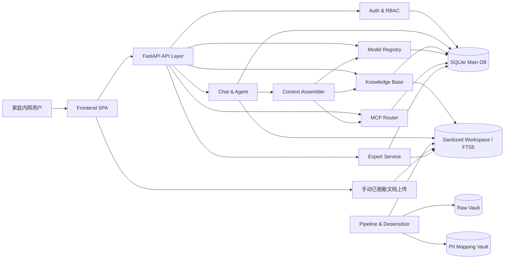
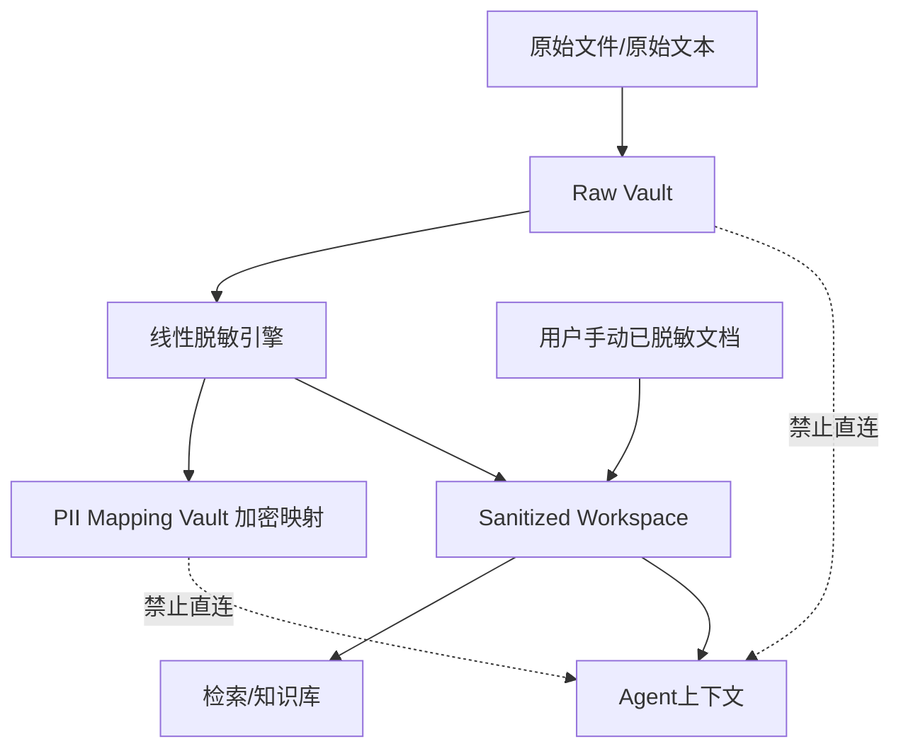
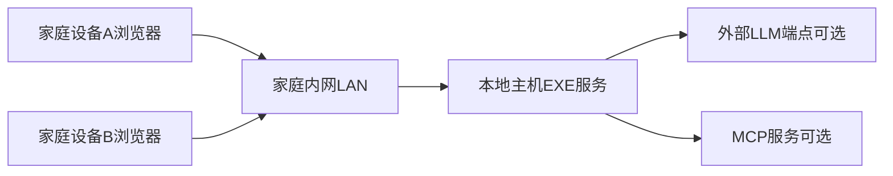

# 家庭健康管理助手: 技术规范与 AI 指令（PRD v1.7）

> 目标: 以“前端布局细化”的同等颗粒度，补齐后端、数据、接口、流程、测试、部署、验收规格，确保可直接按文档实施。

---

## 1. 需求审计总结（含缺失信息）

### 1.1 核心需求（已确认）

- 本地优先: 数据仅保存在本机，支持单机 `.exe`。
- Pipeline 自由度:
  - 原始文件自动转文本。
  - 手动上传 Markdown。
  - 手动上传已脱敏 Markdown。
  - 自动脱敏后人工修订再入库。
- Agent 对话:
  - 会话内附件上传并转文本参与问答。
  - 可选本轮启用 MCP 工具。
  - 会话管理（新建/重命名/归档/删除/搜索）。
  - 会话独立记忆与上下文。
  - 无内部资料时可降级到纯 LLM 对话。
- 用户注册与登录（家庭内网）:
  - 支持本地用户注册、登录、退出、会话管理。
  - 支持首个管理员账户初始化（首次启动引导）。
  - 支持角色权限（Owner/Admin/Member/Viewer）与接口访问控制。
- 模型配置:
  - `API Key + Base URL` 保存后可刷新模型目录并弹窗选择。
  - LLM/Embedding/Reranker 均支持动态发现。
  - 支持 Gemini、DeepSeek 3.2 等模型的推理参数配置（按 provider 能力降级）。
- 知识库:
  - 按标准方案构建（预处理、切块、索引、检索参数、重建策略）。
- 数据导出:
  - 支持文档/病例/体检报告/用药指南/说明书/AI 聊天内容的单选、多选、批量打包导出。
  - 支持按成员、时间范围、数据类型过滤后导出。
  - 支持导出格式选择（原文件、脱敏文本、结构化元数据、ZIP 打包）。
- 前端:
  - 四中心结构（设置/聊天/知识库/导出中心），高端一致视觉风格。

### 1.2 约束与边界

- 首轮数据库固定为 SQLite 单库。
- 检索基线固定为 FTS5，可选增强 Embedding/Reranker。
- 首轮不引入外部队列，采用本地后台任务执行器。
- 默认部署场景为家庭内网，认证体系以本地账号体系为主（不依赖外部 IdP）。
- 脱敏策略首轮固定为“线性脱敏”:
  - 由前端配置敏感词/敏感字符规则（用户可增删）。
  - 文本进入 AI 前按规则逐项替换为脱敏占位符。
  - 建立本地“加密映射库”用于占位符与原值映射（仅本地可解密）。
- 设计红线: Agent 可访问的 workspace 与数据库逻辑上必须全量脱敏，未脱敏数据与其严格隔离。

### 1.3 缺失信息（不阻塞）

- Gemini、DeepSeek 3.2 的最终接入端点清单。
- 是否强制开启会话级模型覆盖（建议默认关闭，可手动开启）。
- 首次管理员注册策略（安装码/本机确认/一次性初始化）最终选择。

### 1.4 体验补强清单（新增，作为 P1/P2 迭代池）

- 家庭成员健康时间线（检查、诊断、用药、复诊）。
- 用药提醒与依从性打卡（可选本地通知）。
- 紧急信息卡（过敏史、慢病、紧急联系人）。
- 家庭共享权限模板（只读、可编辑、敏感字段可见性）。
- 本地备份与恢复向导（含一键回滚点）。
- 数据导出模板（就医提交包、家庭归档包、科研脱敏包）。

---

## 2. 架构决策记录（含备选与权衡）

### ADR-1: 单库与模块化并存

- 决策: SQLite 单库 + 后端 API 包模块化（chat/model/mcp/kb/pipeline）。
- 权衡: 降低部署复杂度，同时保证代码边界清晰。

### ADR-2: 上下文组装统一入口

- 决策: 统一 `Context Assembler` 组装上下文。
- 输入源顺序: 会话记忆 -> 附件文本 -> KB 检索 -> MCP -> 系统提示词。
- 权衡: 可控、可审计、可降级。

### ADR-3: 模型目录动态发现

- 决策: provider 保存后主动刷新模型目录，失败时允许手工填模型名。
- 权衡: 兼顾易用性与可用性。

### ADR-4: 推理参数能力裁剪

- 决策: 按 provider capability 自动裁剪不支持参数。
- 权衡: 避免调用失败，同时保留高级参数入口。

### ADR-5: KB 标准化构建

- 决策: 固定“预处理 -> 切块 -> 索引 -> 质检 -> 发布”流程。
- 权衡: 便于稳定迭代与质量回归。

### ADR-6: 脱敏双域隔离（新增）

- 决策: 数据域拆分为 `Raw Vault` 与 `Sanitized Workspace`。
- 规则:
  - 原始文件、原文文本、原始 PII 仅允许写入 `Raw Vault`。
  - Agent、检索、RAG、MCP 编排链路仅允许读取 `Sanitized Workspace` 与脱敏库。
  - 映射库单独加密存储，不作为 Agent 可读数据源。
- 权衡: 牺牲少量实现复杂度，换取可证明的数据最小暴露面。

### ADR-7: 家庭内网认证模型（新增）

- 决策: 采用本地账号认证（用户名/密码）+ 角色权限控制 + 会话令牌。
- 规则:
  - 首次启动仅允许创建 1 个 `Owner` 账户（初始化完成后关闭开放注册）。
  - 后续注册默认由 `Owner/Admin` 在内网后台创建，避免匿名注册。
  - 密码哈希采用 `Argon2id`，会话采用 `access_token + refresh_token`。
  - API 按角色做授权校验，敏感操作（模型密钥、MCP、脱敏规则）仅 `Owner/Admin` 可写。
- 权衡: 在家庭内网场景下兼顾易用性与安全性。

---

## 3. 系统设计（目录结构 / 数据模型 / 关键流程）

### 3.0 功能模块总览（新增）

| 模块 | 子模块 | 核心职责 | 主要输入 | 主要输出 |
|---|---|---|---|---|
| 认证与权限 | 注册/登录/会话/RBAC | 用户身份认证与权限控制 | 用户凭据、会话令牌 | 用户会话、权限判定结果 |
| 用户与家庭成员 | 用户管理/成员管理 | 管理家庭账号与成员数据隔离 | 用户操作请求 | 成员信息、访问边界 |
| 文档与脱敏 | 上传/解析/线性脱敏/映射库 | 原文处理与脱敏隔离 | 原始文件、Markdown、规则 | 脱敏文本、映射记录 |
| 知识库 | 切块/索引/构建/重建 | 生成可检索知识数据 | 脱敏文本、KB 参数 | 索引分片、构建状态 |
| 对话与Agent | 会话/记忆/上下文组装/问答 | 生成可追溯回答 | Query、会话、附件、检索结果 | 回答、引用、工具告警 |
| MCP 工具层 | Server 管理/路由/超时降级 | 外部工具调用编排 | MCP 配置、调用参数 | 工具结果、失败告警 |
| 模型配置层 | Provider/目录刷新/Profile | 管理模型与运行参数 | API Key、Base URL、模型选择 | LLM/Embedding/Reranker 配置 |
| 数据导出层 | 选择器/打包器/下载任务 | 多类型数据导出与归档 | 导出范围、筛选条件、格式策略 | ZIP 包、导出清单、任务状态 |
| 观测与运维 | 日志/指标/诊断页 | 可观测与故障定位 | 请求链路与状态 | 监控指标、诊断信息 |

### 3.1 目录结构（强约束）

```text
family_health/
├── backend/app/
│   ├── api/v1/
│   │   ├── auth.py
│   │   ├── chat.py
│   │   ├── agent.py
│   │   ├── pipeline.py
│   │   ├── knowledge_base.py
│   │   ├── model_registry.py
│   │   └── mcp.py
│   ├── services/
│   │   ├── auth_service.py
│   │   ├── context_assembler.py
│   │   ├── chat_memory_service.py
│   │   ├── file_ingest_service.py
│   │   ├── kb_builder_service.py
│   │   ├── retrieval_service.py
│   │   ├── model_registry_service.py
│   │   └── mcp_router.py
│   ├── models/
│   ├── schemas/
│   └── core/
├── frontend/src/
│   ├── pages/
│   ├── components/
│   ├── api/
│   └── styles/tokens.css
├── doc/api/
└── docs/
```

### 3.2 数据模型与约束（补齐）

- `users`
  - 字段: `id`, `username`, `password_hash`, `display_name`, `role`, `status`, `created_at`, `updated_at`, `last_login_at`
  - 唯一键: `(username)`
  - 状态: `active|disabled`
- `user_sessions`
  - 字段: `id`, `user_id`, `refresh_token_hash`, `device_label`, `ip_addr`, `expires_at`, `revoked_at`, `created_at`
  - 索引: `(user_id, expires_at)`, `(revoked_at)`
- `auth_audit_logs`
  - 字段: `id`, `user_id`, `action`, `result`, `ip_addr`, `user_agent`, `trace_id`, `created_at`
  - 索引: `(user_id, created_at desc)`, `(action, created_at desc)`
- `export_jobs`
  - 字段: `id`, `created_by`, `member_scope`, `filters_json`, `export_types_json`, `include_raw_file`, `include_sanitized_text`, `status`, `archive_path`, `created_at`, `updated_at`
  - 状态: `pending|processing|done|failed|expired`
- `export_items`
  - 字段: `id`, `job_id`, `item_type`, `item_id`, `source_path`, `sanitized_path`, `meta_json`, `created_at`
  - 索引: `(job_id, item_type)`, `(item_type, item_id)`
- `chat_sessions`
  - 字段: `id`, `member_id`, `title`, `runtime_profile_id`, `archived`, `created_at`, `updated_at`
  - 索引: `(member_id, updated_at desc)`, `(archived)`
- `chat_messages`
  - 字段: `id`, `session_id`, `role`, `content`, `tool_calls_json`, `citations_json`, `created_at`
  - 索引: `(session_id, created_at asc)`
- `chat_attachments`
  - 字段: `id`, `session_id`, `message_id`, `file_path`, `text_path`, `parse_status`, `created_at`
  - 状态: `pending|processing|done|error`
- `model_providers`
  - 字段: `id`, `provider_name`, `base_url`, `api_key_encrypted`, `enabled`, `last_refresh_at`, `updated_at`
  - 唯一键: `(provider_name, base_url)`
- `model_catalog`
  - 字段: `id`, `provider_id`, `model_name`, `model_type`, `capabilities_json`, `updated_at`
  - 唯一键: `(provider_id, model_name)`
- `llm_runtime_profiles`
  - 字段: `id`, `name`, `llm_model_id`, `embedding_model_id`, `reranker_model_id`, `params_json`, `is_default`, `updated_at`
  - 唯一键: `(name)`
- `mcp_servers`
  - 字段: `id`, `name`, `endpoint`, `auth_type`, `auth_payload_encrypted`, `enabled`, `timeout_ms`, `updated_at`
  - 唯一键: `(name)`
- `agent_mcp_bindings`
  - 字段: `id`, `agent_name`, `mcp_server_id`, `enabled`, `priority`, `updated_at`
  - 唯一键: `(agent_name, mcp_server_id)`
- `knowledge_bases`
  - 字段: `id`, `name`, `member_scope`, `chunk_size`, `chunk_overlap`, `top_k`, `rerank_top_n`, `embedding_model_id`, `reranker_model_id`, `status`, `updated_at`
  - 状态: `draft|building|ready|failed`
- `kb_documents`
  - 字段: `id`, `kb_id`, `member_id`, `source_type`, `source_path`, `masked_path`, `status`, `error_message`, `updated_at`
  - 状态: `pending|processing|indexed|error`
- `kb_chunks`
  - 字段: `id`, `kb_id`, `document_id`, `member_id`, `chunk_text`, `chunk_order`, `token_count`, `created_at`
  - 索引: `(kb_id, member_id)`, `(document_id, chunk_order)`
- `desensitization_rules`
  - 字段: `id`, `member_scope`, `rule_type`, `pattern`, `replacement_token`, `enabled`, `updated_at`
  - 说明: `rule_type` 首轮支持 `literal|regex`，默认优先 `literal` 线性替换。
- `pii_mapping_vault`
  - 字段: `id`, `mapping_key`, `original_value_encrypted`, `replacement_token`, `hash_fingerprint`, `created_at`
  - 说明: 本地加密映射库，仅服务端在受控流程中访问，Agent 禁止直接访问。

### 3.2.1 数据物理隔离约定（强制）

- 存储目录固定双域:
  - `data/raw_vault/`（未脱敏域）
  - `data/sanitized_workspace/`（脱敏域）
- DB 逻辑隔离:
  - Raw 表（含原文路径、原文摘要）与 Sanitized 表（脱敏文本、索引）分层访问。
  - Agent 相关 API 不得返回 raw 路径、raw 文本、raw 映射内容。
- 权限隔离:
  - `context_assembler`、`retrieval_service`、`mcp_router` 仅注入 sanitized 数据源。
  - 任何尝试读取 raw 数据的调用必须在服务层拒绝并记录安全日志。

### 3.3 状态机（补齐）

- 用户状态机
  - `pending_init -> active`
  - `active -> disabled -> active`
- 会话令牌状态机
  - `issued -> active -> rotated|revoked|expired`
  - `rotated -> expired`
- 会话状态机
  - `active -> archived -> active`
  - `active|archived -> deleted(软删除)`。
- 附件解析状态机
  - `pending -> processing -> done|error`
  - `error -> processing`（手动重试）。
- KB 文档状态机
  - `pending -> processing -> indexed|error`
  - `error -> processing`（重建重试）。
- KB 状态机
  - `draft -> building -> ready|failed`
  - `ready -> building`（增量/全量重建）。

### 3.4 API 契约颗粒度（补齐）

- 响应包络固定:
  - 成功: `{ "code": 0, "data": {...}, "message": "ok", "trace_id": "..." }`
  - 失败: `{ "code": <int>, "data": null, "message": "...", "trace_id": "..." }`
- 分页查询固定参数:
  - `page`（从 1 开始）
  - `page_size`（默认 20，最大 100）
  - 返回 `total`、`items`。
- 关键 API 清单:
  - `POST /api/v1/auth/bootstrap-owner`
  - `POST /api/v1/auth/login`
  - `POST /api/v1/auth/refresh`
  - `POST /api/v1/auth/logout`
  - `POST /api/v1/auth/users`（管理员创建用户）
  - `PATCH /api/v1/auth/users/{id}/role`
  - `PATCH /api/v1/auth/users/{id}/status`
  - `POST /api/v1/chat/sessions`
  - `GET /api/v1/chat/sessions`
  - `PATCH /api/v1/chat/sessions/{id}`
  - `DELETE /api/v1/chat/sessions/{id}`
  - `POST /api/v1/chat/sessions/{id}/messages`
  - `POST /api/v1/chat/sessions/{id}/attachments`
  - `POST /api/v1/model-providers`
  - `POST /api/v1/model-providers/{id}/refresh-models`
  - `GET /api/v1/model-catalog`
  - `POST /api/v1/mcp/servers`
  - `POST /api/v1/mcp/servers/{id}/ping`
  - `POST /api/v1/agent/qa`
  - `POST /api/v1/knowledge-bases`
  - `POST /api/v1/knowledge-bases/{id}/build`
  - `POST /api/v1/knowledge-bases/{id}/rebuild`
  - `POST /api/v1/exports/jobs`
  - `GET /api/v1/exports/jobs`
  - `GET /api/v1/exports/jobs/{id}`
  - `GET /api/v1/exports/jobs/{id}/download`
  - `DELETE /api/v1/exports/jobs/{id}`
- `agent/qa` 请求补齐:
  - `session_id`
  - `query`
  - `enabled_mcp_ids`（可选）
  - `runtime_profile_id`（可选）
  - `attachments_ids`（可选）

### 3.5 关键流程（补齐执行细节）

0. 内网注册与登录流程（新增）
- 首次启动:
  - 检测无 `Owner` 账户 -> 开放 `bootstrap-owner` 一次性初始化接口。
- 常规登录:
  - 用户名密码校验 -> 颁发 access/refresh token -> 写入 `user_sessions`。
- 会话续期:
  - refresh token 轮换，旧 token 立即失效。
- 权限校验:
  - 每次 API 请求通过 JWT + RBAC 校验角色范围。

0.5 用户手动提交脱敏文档流程（新增）
- 用户上传 `masked_markdown` 或“确认已脱敏”文档。
- 服务端执行最小合规检查（高风险模式扫描 + 规则一致性检查）。
- 通过后直接写入 `Sanitized Workspace` 并进入 KB/检索流程。
- 不通过则阻断入库并返回可操作修订提示。

1. 对话请求执行顺序
- 参数校验 -> 会话权限校验 -> 装配上下文 -> 可选 MCP 调用 -> LLM 调用 -> 存消息 -> 返回。

2. 上下文预算策略
- 最大上下文 token 预算按 profile 控制。
- 裁剪顺序:
  - 先裁剪历史消息
  - 再裁剪附件文本
  - 最后裁剪检索片段。

3. MCP 调用策略
- 并发调用上限 `max_parallel_tools=3`。
- 单工具超时默认 `8s`，总工具预算 `15s`。
- 任一工具失败不阻断主流程，写入 `tool_warning`。

4. 模型刷新策略
- 保存 provider 后可触发刷新。
- 刷新缓存 TTL 默认 `12h`。
- 刷新失败保持旧目录可用。

5. KB 构建策略
- 默认参数:
  - `chunk_size=1000`
  - `chunk_overlap=150`
  - `top_k=8`
  - `rerank_top_n=4`
- 任务并发:
  - 文件解析并发 `2`
  - 切块索引并发 `2`

6. 线性脱敏执行流程（新增）
- 步骤 1: 前端提交敏感词/字符规则（可按成员或全局）。
- 步骤 2: 文件转文本后先进入 `Raw Vault`，计算 fingerprint。
- 步骤 3: 按规则线性扫描替换（从前到后，稳定顺序，不回溯重排）。
- 步骤 4: 生成 `replacement_token`，写入 `pii_mapping_vault`（加密原值）。
- 步骤 5: 脱敏文本写入 `Sanitized Workspace`，仅该版本可用于检索与 Agent。
- 步骤 6: 若聊天中上传含个人信息附件，同样先过上述流程，未经脱敏不得注入上下文。

7. 数据导出流程（新增）
- 步骤 1: 用户在导出中心选择成员、时间范围、数据类型（单选/多选）。
- 步骤 2: 系统生成 `export_job` 并异步收集资源清单。
- 步骤 3: 按策略打包（原文件/脱敏文本/结构化元数据）。
- 步骤 4: 生成 ZIP 与 `manifest.json`，提供一次性下载链接。
- 步骤 5: 导出包过期自动清理（默认 24h）。

### 3.6 前端布局详细约定（强制）

1. 全局 IA
- 预登录态页面: 登录页 / 首次管理员初始化页。
- 左侧导航 + 右侧工作区。
- 一级导航固定: `设置中心`、`聊天中心`、`知识库中心`、`导出中心`。
- 顶栏固定: 成员切换、全局搜索、系统状态。

2. 页面线框
- 登录页（单栏卡片）:
  - 用户名、密码、记住设备、登录按钮、错误提示区。
  - 首次启动时显示“初始化 Owner 账户”引导。
- 设置中心（双栏）:
  - 左栏配置分组
  - 右栏表单/模型弹窗/测试按钮
- 聊天中心（三栏）:
  - 左栏会话列表（28%）
  - 中栏消息流（52%）
  - 右栏工具与上下文（20%）
- 知识库中心（双栏）:
  - 左栏知识库列表
  - 右栏参数与任务时间线
- 导出中心（双栏）:
  - 左栏导出筛选器（成员、时间、数据类型、是否含原文件）
  - 右栏导出任务列表（状态、大小、创建人、下载、删除）

3. 响应式
- `>=1280px`: 三栏/双栏。
- `768~1279px`: 聊天右栏折叠抽屉。
- `<768px`: 单栏 + 底部导航。

4. 5 态反馈
- `loading`、`empty`、`error`、`success`、`offline/degraded`。

5. UI 约束
- Design Token 单点维护于 `styles/tokens.css`。
- 关键组件全部复用，禁止页面临时样式拼接。

---

## 4. 详细实现要求（错误处理 / 测试 / 安全 / 性能）

### 4.1 错误码分层（补齐）

- `1xxx` 参数与校验错误。
- `2xxx` 资源不存在或状态冲突。
- `3xxx` 外部依赖错误（LLM/MCP/解析器）。
- `4xxx` 权限与安全错误。
- `5xxx` 系统内部错误。

### 4.2 错误处理细则（补齐）

- 所有错误必须带 `trace_id`。
- 业务错误 `message` 面向用户可读，不暴露敏感细节。
- LLM/MCP 超时必须返回可识别错误码并带可重试建议。

### 4.3 测试矩阵（补齐）

- 单元测试:
  - context 裁剪
  - 状态机迁移
  - capability 裁剪
- 集成测试:
  - 会话消息全链路
  - 附件上传转文本
  - MCP 选择性调用
  - KB 构建与重建
- E2E:
  - 配置模型 -> 开始对话 -> 上传附件 -> 触发 MCP
  - 建 KB -> 入库 -> 命中检索 -> 引用回答

### 4.4 安全基线（补齐）

- 敏感字段:
  - `api_key_encrypted`
  - `auth_payload_encrypted`
- 加密策略:
  - 本机密钥来源环境变量
  - 禁止明文落盘
- 认证策略:
  - 密码哈希: `Argon2id`（禁止明文或弱哈希）
  - access token 短期有效（建议 15 分钟），refresh token 长期有效（建议 7 天）
  - 连续登录失败触发临时锁定（建议 5 次失败锁定 15 分钟）
  - 默认仅内网访问，禁止默认公网暴露
- 导出策略:
  - 导出任务默认仅创建者与 `Owner/Admin` 可下载。
  - 导出包必须包含 `manifest.json`（来源、时间、脱敏标记、导出人）。
  - 含原文件导出需二次确认并记录审计日志。
- 上传策略:
  - 最大 20MB（首轮）
  - 白名单后缀与 MIME 双重校验
  - 文件名标准化 + 隔离目录
- 输出策略:
  - 默认附非医疗诊断免责声明
  - 引用来源可追溯。
- 脱敏红线:
  - Agent 输入上下文禁止含 raw 文本。
  - workspace 中供 Agent 访问的数据必须全部来自 `Sanitized Workspace`。
  - 数据库中供 Agent 查询的表必须为脱敏表或脱敏视图。
  - 映射库仅用于受控回显/审计，不进入 LLM prompt，不进入 MCP 入参。

### 4.4.1 脱敏质量门禁（新增）

- 构建/会话注入前必须执行脱敏检查:
  - 命中规则数 > 0 时必须存在对应 mapping 记录。
  - 若检测到未替换的高风险模式（手机号/身份证/地址等）则阻断注入。
- 质量指标:
  - 脱敏漏检率目标 `< 0.1%`（基于规则集回归样本）。
  - 脱敏任务失败率纳入可观测指标并告警。

### 4.5 可观测性与运维（补齐）

- 结构化日志字段:
  - `ts`, `level`, `trace_id`, `session_id`, `api`, `latency_ms`, `status`
- 关键指标:
  - 登录成功率
  - 登录失败率/锁定率
  - 对话成功率
  - MCP 成功率
  - 模型刷新成功率
  - KB 构建失败率
  - 导出任务成功率
  - 导出包平均生成时延
- 本地诊断页:
  - 最近 100 条错误摘要
  - MCP 连通状态
  - 模型目录更新时间

### 4.6 性能 SLO（补齐）

- 对话首 token P95 `< 3s`（无工具调用）。
- 带 MCP 调用对话完整响应 P95 `< 12s`。
- 模型目录刷新 P95 `< 5s`。
- 会话列表分页 P95 `< 300ms`（1 万消息规模）。
- KB 增量重建单文档 P95 `< 30s`（中等文档）。

### 4.7 文档交付（强制）

- 前端变更: 更新 `docs/USER_GUIDE.md`。
- 后端/API/环境变更: 更新 `doc/DEPLOYMENT.md` 和 `doc/api/*.md`。
- 文档必须包含:
  - 目标
  - 前置条件
  - 步骤
  - 预期结果
  - 故障排查
  - 回滚。

---

## 5. AI 执行指令（分阶段任务清单）

### 阶段 0: 基础骨架与公共约束

1. 初始化 DB 模型、迁移框架、统一响应与错误码。
2. 落地 `trace_id` 中间件与结构化日志。
3. Checkfix:
   - `uv venv`
   - `uv sync`
   - `ruff check .`
   - `ruff format --check .`（或 `black --check .`）
   - `pytest`

### 阶段 0.5: 内网认证与用户体系（新增）

1. 实现 `users`、`user_sessions`、`auth_audit_logs` 模型与迁移。
2. 实现初始化 Owner、登录、刷新、退出、管理员建用户 API。
3. 实现 JWT 鉴权中间件与 RBAC 授权装饰器。
4. 实现登录失败锁定与审计日志。
5. 文档:
   - `doc/api/auth.md`
   - `doc/DEPLOYMENT.md`（内网访问与默认安全配置）
6. Checkfix:
   - `uv sync`
   - `ruff check .`
   - `ruff format --check .`
   - `pytest`

### 阶段 1: 模型目录与运行配置

1. 实现 provider CRUD、模型刷新、模型目录查询 API。
2. 实现 runtime profile（LLM/Embedding/Reranker + params）API。
3. 落地 capability 裁剪与默认参数模板（Gemini/DeepSeek 3.2）。
4. 文档:
   - `doc/api/model_registry.md`
5. Checkfix:
   - `uv sync`
   - `ruff check .`
   - `ruff format --check .`
   - `pytest`

### 阶段 2: 聊天管理与上下文记忆

1. 实现会话 CRUD、搜索、归档、软删除 API。
2. 实现消息发送与存储、上下文窗口+摘要策略。
3. 实现附件上传解析与会话临时知识注入。
4. 实现“聊天附件先脱敏后注入”强制门禁，未脱敏文本禁止进入上下文。
5. 文档:
   - `doc/api/chat.md`
   - `doc/api/agent.md`
6. Checkfix:
   - `uv sync`
   - `ruff check .`
   - `ruff format --check .`
   - `pytest`

### 阶段 3: MCP 全局配置与选择性调用

1. 实现 MCP server CRUD、连通性检测 API。
2. 实现 `enabled_mcp_ids` 会话/本轮覆盖逻辑。
3. 实现 `mcp_router` 并发、超时、降级策略。
4. 文档:
   - `doc/api/mcp.md`
   - 更新 `doc/api/agent.md`
5. Checkfix:
   - `uv sync`
   - `ruff check .`
   - `ruff format --check .`
   - `pytest`

### 阶段 4: 知识库标准构建

1. 实现 KB CRUD、构建、增量重建、全量重建 API。
2. 实现文档状态机、索引任务、失败重试。
3. 实现线性脱敏规则引擎、加密映射库与双域存储隔离。
4. 实现检索接口与引用来源结构化返回（仅脱敏域数据）。
5. 实现导出任务 API（创建、查询、下载、删除）与 ZIP 打包器。
6. 文档:
   - `doc/api/knowledge_base.md`
   - `doc/api/retrieval.md`
   - `doc/api/desensitization.md`
   - `doc/api/export.md`
7. Checkfix:
   - `uv sync`
   - `ruff check .`
   - `ruff format --check .`
   - `pytest`

### 阶段 5: 前端四中心实现与验收

1. 设置中心:
   - provider 配置
   - 模型刷新弹窗选择
   - runtime profile 参数编辑
2. 聊天中心:
   - 三栏布局
   - 会话管理
   - 附件上传
   - MCP 多选
3. 知识库中心:
  - 参数配置
  - 构建任务与状态展示
4. 导出中心:
   - 单选/多选数据类型选择器
   - 导出任务列表与下载管理
   - 一键打包下载与过期提示
5. 认证页面与权限前端:
   - 登录页与首次 Owner 初始化页
   - 按角色控制导航可见性与按钮权限
   - 会话过期自动跳转登录页
6. UI 规范:
   - 断点规则
   - 5 态反馈
   - 组件化复用
7. 文档:
   - `docs/USER_GUIDE.md`
   - `doc/DEPLOYMENT.md`
8. Checkfix:
   - `npm install`（依赖变更时）
   - `npm run lint`（或 `npx eslint .`）
   - `npm run build`
   - 后端 `uv sync && ruff check . && ruff format --check . && pytest`

### 阶段 6: 集成验收与发布

1. 执行全链路验收用例（登录 -> 配置 -> 对话 -> MCP -> KB -> 引用回答 -> 数据导出下载）。
2. 生成发布清单:
   - 配置模板
   - 已知问题
   - 回滚步骤
3. 打包 `.exe` 冒烟验证。
4. 文档冻结并标记版本号。

---

## 附录 A: 架构图（新增）

### A.1 系统逻辑架构图



### A.2 脱敏隔离架构图



### A.3 家庭内网部署拓扑图



*文档版本: 1.7（2026-02-16）*
